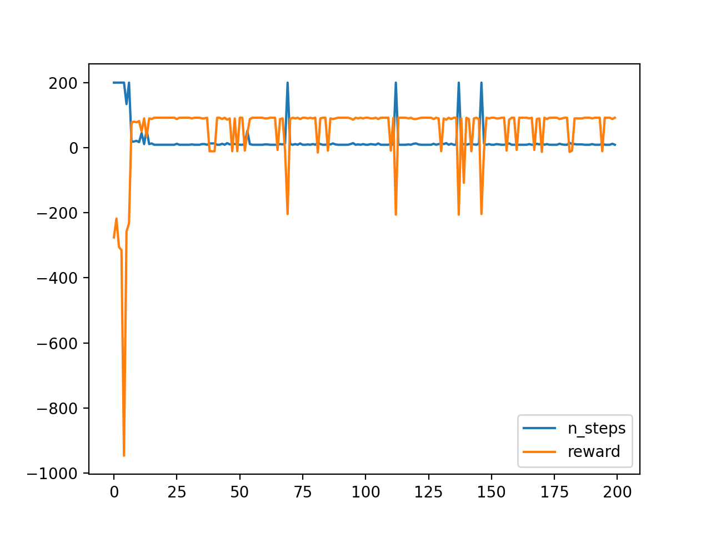

# skinner
Skinner, a new framework of reinforcement learning by Python

It is built for the beginner of RL.


It is under development, but runs stably.


## Requrements

- gym
- numpy

## Download

download from github, or pypi by pip command `pip install skinner`.

## Design

We consider the **observer design pattern**. The env and agents in it observe each other generally. The agents observe the env to how to act and got the reward, env observe the agents and other objects to render the viewer and record the information.

## Feature

so easy

## Use

### Quick start

run `demo1.py` in examples.

### Define envs

If you just want to build a simple env, then the following is an option, a grid world.

```python
#!/usr/bin/env python3
# -*- coding: utf-8 -*-

"""Demo of RL V2.0

An env with some traps and a gold.
"""

from skinner import *
from gym.envs.classic_control import rendering

from objects import *

class MyGridWorld(GridMaze, SingleAgentEnv):
    """Grid world
    
    A robot playing the grid world, tries to find the golden (yellow circle), meanwhile
    it has to avoid of the traps(black circles)
    Extends:
        GridMaze: grid world with walls
        SingleAgentEnv: there is only one agent
    """
    
    # configure the env
    
    # get the positions of the objects
    CHARGER = ...
    TRAPS = ...
    DEATHTRAPS = ...
    GOLD = ...

    def __init__(self, *args, **kwargs):
        super(MyGridWorld, self).__init__(*args, **kwargs)
        self.add_walls(conf['walls'])
        self.add_objects((*traps, *deathtraps, charger, gold))

    # Define the condition when the demo of rl will stop.
    def is_terminal(self):
        return self.agent.position in self.DEATHTRAPS or self.agent.position == self.GOLD or self.agent.power<=0

    def is_successful(self):
        return self.agent.position == self.GOLD

    # Following methods are not necessary, that only for recording the process of rl
    def post_process(self):
        if self.is_successful():
            self.history['n_steps'].append(self.agent.n_steps)
        else:
            self.history['n_steps'].append(self.max_steps)
        self.history['reward'].append(self.agent.total_reward)
        self.agent.post_process()

    def pre_process(self):
        self.history['n_steps'] = []
        self.history['reward'] = []

    def end_process(self):
        import pandas as pd
        data = pd.DataFrame(self.history)
        data.to_csv('history.csv')


```


### Define objects

1. the shape of object (circle by default)
2. the method to plot (don't override it, if the shape is simple)

```python
class _Object(Object):
    props = ('name', 'position', 'color', 'size')
    default_position=(0, 0)  # set default value to help you reducing the codes when creating an object

    @property
    def coordinate(self):
        # the coordinate where the object is plotted
        ...

class Gold(_Object):
    def draw(self, viewer):
        '''this method is the most direct to determine how to plot the object
        You should define the shape and coordinate
        '''
        ...

class Charger(_Object):
    def create_shape(self):
        '''redefine the shape, here we define a squre with edges length of 40.
        The default shape is a circle
        '''
        a = 20
        self.shape = rendering.make_polygon([(-a,-a), (a,-a), (a,a), (-a,a)])
        self.shape.set_color(*self.color)
```


### Define agents

1. transition function $f(s,a)$
2. reward function $r(s,a,s')$

```python
from skinner import *

class MyRobot(StandardAgent):
    actions = Discrete(4)
    
    # define the shape
    size = 30
    color = (0.8, 0.6, 0.4)

    def _reset(self):
        # define the initial state
        ...
        
    def _next_state(self, state, action):
        """transition function: s, a -> s'
        """
        ...


    def _get_reward(self, state0, action, state1):
        """reward function: s,a,s'->r
        """
        ...


# define parameters
agent = MyRobot(alpha = 0.3, gamma = 0.9)
```


## Example

### codes

see scripts in `examples`

### results




## Commemoration

In memory of [B. F. Skinner](https://www.bfskinner.org/) (1904-1990), a great American psychologist

 
